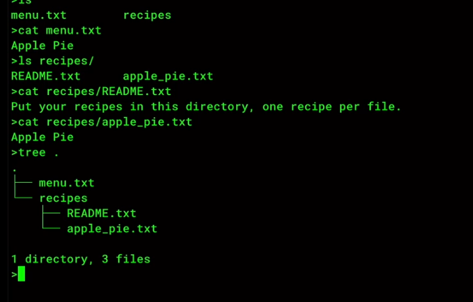
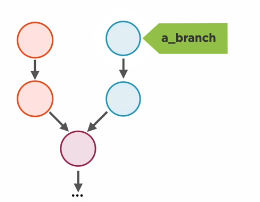
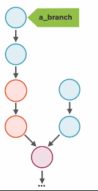
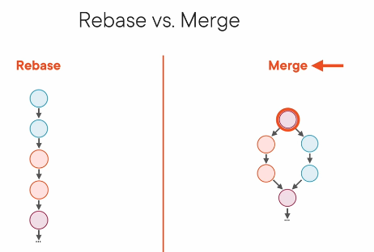
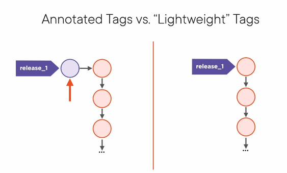

## internal git
### porcelain commands (high level user command)
ex: 
* git add
* git commit 
* git push
* git branch
### plumbing commands (low-level commands)

basic building bricks that the porcelain commands are build upon
* git cat-file
* git hash-object
* git count-object

## Understand git
imagine git as stupid content tracker.
now git it a map keys and values
the value is sequence of bytes, the content of text file or even a binary file.
git calculate hashes with an algorithm called SHA-1(20 bytes in hexa so they are 40 hex digits). every piece of content has its own hash.
if you ask git to generate a hash string out of this string "Apple pie" the result will be the key of this content in the map
``` bash
echo "Apple pie"  | git hash-object --stdin
# 66153c3f111f0bfac4ec2ca47eb390c87a4226bc
```
### ex
``` bash
git init

# create file in .git/objects named 05(represent the first 2 hexidecimal digits of hashed key generated)
# the generated file name is the remaining hashed key this file is called blob of data
# to read the content of the file use git cat-file(plumbing command low-level)
    # git cat-file <hexidecimal key> -t(show type) / -p(content of file)
# git use this schema to orginize content and spread it over multiple directories 
# objets folder called objects databsae
# NOW WHAT: git hash content and generte key and then persist. so git it persistence map and this is the very basic of the git model
echo Apple pie  | git hash-object --stdin -w

```

### content tracker 
- create project 


- open .git/objects it is empty of persistence content 
- to track changes use git add it will add changes to the staging area
- then git commit 
    - it will creat file that has meta data about commit and has tree 
    - tree that contain a list of hashes  

## virsioning
- when you change a file the file is untracked by git. git  add to be tracked and add to staged area
- git create new commit file that is child from the first commit and has new tree and blob depends on changes
- git keep the unchaged file tracked by the child and parent commmit
- if you have large file git only store only the diffrence between thus files and compressed the changes(optimization layer in git)
- to get number of objects use git count-objects

#### notes
types in git
- annotated tag
- commit
- tree
- blob

## Branches
branch is a pointer(refrence) to a commit
* branch exist in .git/refs/heads/master
``` bash
    git cat-file .git/refs/heads/master
    # you can read branch file cause it is not hashed
    # the result include hashed key that key represent a pointer to a commit 
```
to check what is current branch
```bash
# list all exist branch
git branch

# change current branch
# current branch is headed in ./git/HEAD
git chekout <branch-name>

```

### merge
when you merge two branches you git commit has two parents commits

### travel back in time
Git mostly care about objects in the database not your working directory
- Files in the working directory are transient, objects in the database are immutable

### detached head
you can check out commit
ex:
``` bash 
git checkout 01b60d
git cat-file ./git/Head
# result >> 01b60d3f4d7c8a3531f9946b95bf72eb50789c94
```
if you change in file and commit. that commit is not refrenced or reached by any object
so when you checkout to a real brach the garabge collector will remove thus commits at some point of time to save disk space

- to save the commit before the GC remove it just create branch when you are in detached head by key of that commit. then back to main branch or any other branch


# Git rebase
- 
``` bash
git branch 
# * main
#   a-branch
git rebase a-branch
```
what happes?
- when you rebase git get coppies of the a-branch 's commits from last commit to the commit previous the shared commit with main

- if you look the a-branch old commit are not refrenced with any branch
- according to git rules all object that not refrenced The GC will remove it at some point of time

### Rebase VS Merge


##### merge
- Merge represent hoitory exactly as it happed
- Merge Create no commit to fix conflict
- MERGE Never lie

##### Rebase
the project that uses a lot of rebase is generally looks more streamlined and more clear but came with a cost and refactor history
- this design is not real
- rabase lie rebase change the project history

>
When it doubt just merge
>

## Tags
tags located in ./git/refs/tags



- annotated tag : create an brnanch like object that point to a tag object that point to a commit
- lightwight tag : just a lable it dosent need object cause it dosen't has metadata 
- TAGS dosent move like branch it stick to an object for ever


