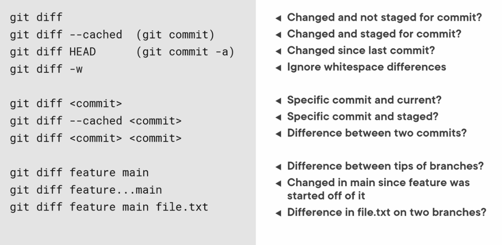
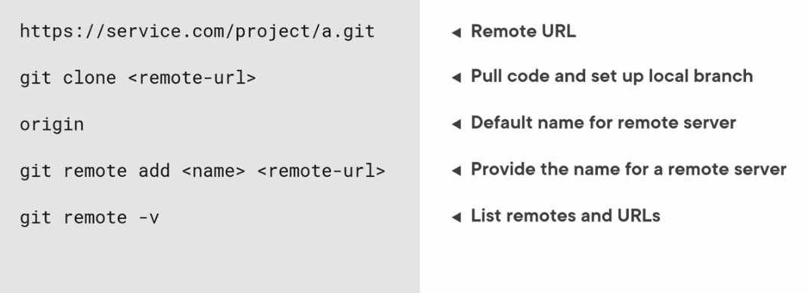
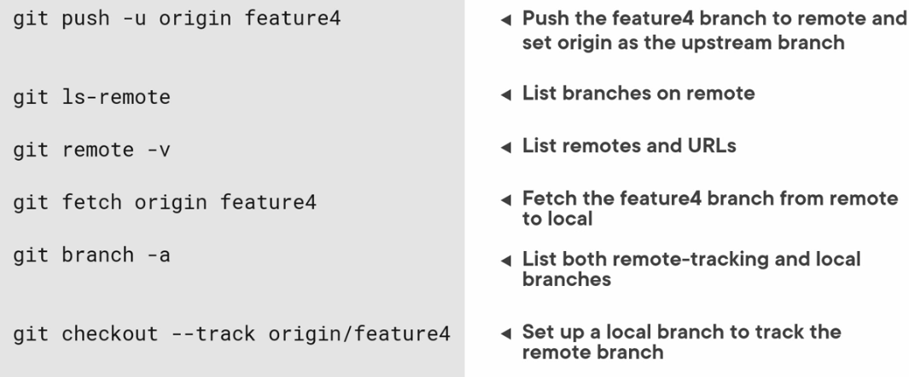
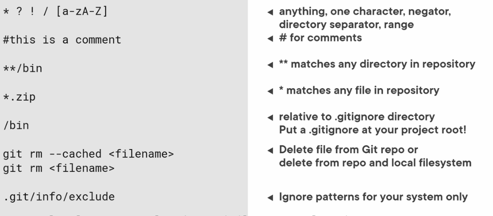
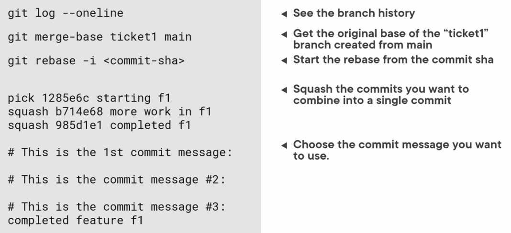
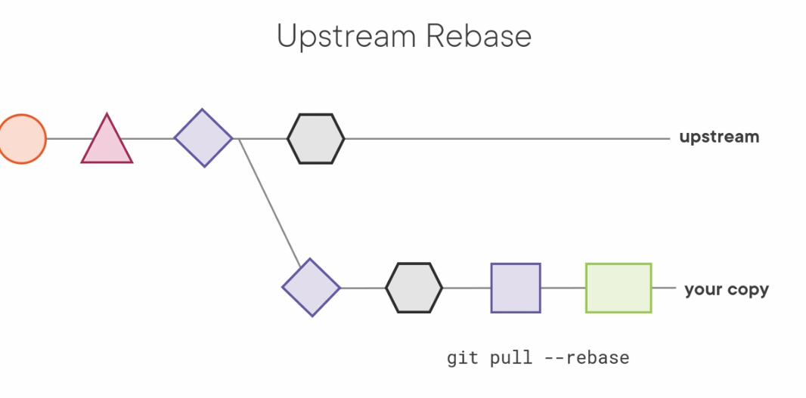
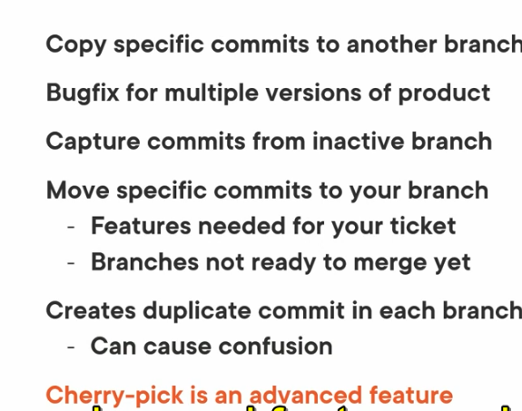

# Working with branches
```bash
# create branch
git checkout -b <branch name>
git switch -c <branch name>

# swith branches
git checkout <branch name>
git switch <branch name>

# rename branch
git branch -m <old name> <new name>
# rename current branch
git checkout -m <new name for current branch>
# delete branch
# you cant delete your current working branch
# you cant delete uncommited branch but you can with force command
git branch -d <branch name>
# force delete branch
git branch -D <branch name>
```

## Merging Branches
for an example to merge main branch as target with fog branch
``` bash
# switch to target branch
git checkout main
git merge fog
```

## diff



## remote 




## Ignore file
https://github.com/github/gitignore



## Rebase
do not use rebase in a public branch. you always is going to cuase confusion
#### Rebase senarios
- clean up local history before sharing a branch
- pull changes from a branch into your branch without performing merge
- squash commits b

#### squash


#### rebase from main

##### senario if other developer rebase master


#### using cherry pick
making a copy of a commit in a different branch with a new parent in the branch you are picking into



