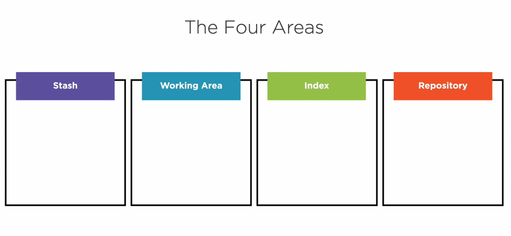
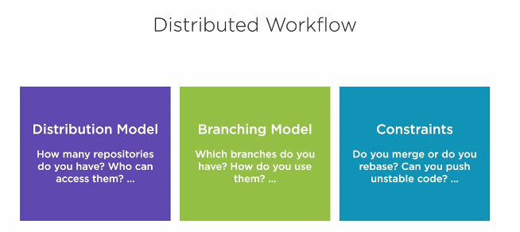
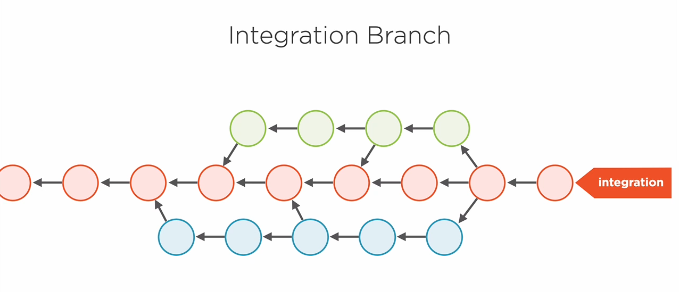
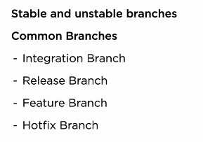
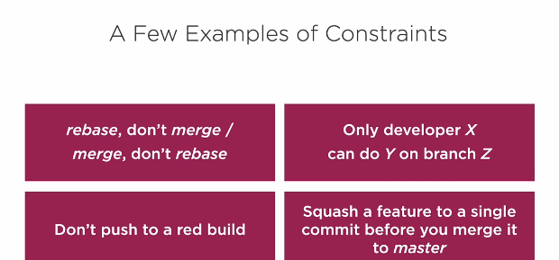
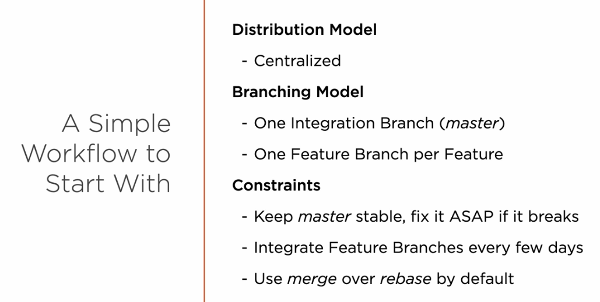

# The Four Areas


- the index area is also called stage area located in .git/index
- repository is located in .git/objects
- to compare between working directory and index(stage) area use: git diff
- to compare between index(stage) and repository use git diff --cached

## Basic workflow
## rename file
### understanding reset
* four commands that move branch
    - commit
    - merge
    - rebase
    - pull
  
reset move branch to specific commit but is dosent HEAD, Head move with the current branch
- if you use with option --hard it copies data to working directory and index(stage)
- if you use with option (defualt)--mixed it copies data to index(stage) only
- if you use with option (defualt)--soft it just move the branch

Reset head
``` bash
# reset Head does not move branch it only copies data 
# defualt --mixed
# if change is in staged it will copies data from repository to index 
git reset HEAD

#reset single file
git reset HEAD menu.txt

# what you want reset working directory too
# git will refuse using: git reset --hard HEAD menu.txt
# the right answer is
git checkout HEAD menu.txt # it will copies data from repo to working directory and index
# in this case checkout is not going to move head
# be careful this is most distrucive command in git use it carefully
```

*this are more about reset search...*

## Advanced Tool
#### Stashing Data
commands:
- git stash --include-untracked
  - stash files that have been added. files that are entirley new in working directory
- to include stashed data agian use: git stash | git stash <stashid>
- clear stash : git stash clear
- list all stash : git stash list
  
#### committing part of a file
```bash
git add --patch menu.txt
```
it will split changes into hunks you can choose hunk to commit
whenever you use git status
- you will find to modification 
  - unstaged if you ignore some hunks
  - and staged to commit

NOTE:
some commands use patch option
- add
- checkout
- stash
- reset

#### switch and restore

# History 
#### commands
```bash
# log in graph presentation
git log --graph --decorate --oneline

# show details of commit
git show HEAD
git Show <branch name>
git show <commit hash>
git show HEAD* # show parent commit
git show HEAD*^ # show parent of the parent of HEAD
git show HEAD`

# tack changes of file
git blame <file name>

# compare content of two area files, branches
git diff <>
```

### git log
```bash
# log graph
git log --graph --decorate --oneline
# search for commit that contain apple in thier message
git log --grep apple
# search from commits that add or remove apple in file
git log -Gapple --patch # patch option to show which line exctly impacted
# list commits in branch1 that not exist in branch2
git log branch1..brnach2 --oneline
```
## fixing mistakes
#### GOLDEN RULE
>
Never rebase shared commit
>

#### Amend commit
if you commit change and you want over edit that commit with new change
- git add <file>
- git commit --amend
- edit the opened windws and close it
- saved

what happend?
the commit by default is immutable. so git copy the commit and refrence the new commit with new message. the old commit will be grabaged collected in future.
it is work only with last commit

###### what if you want edit commit that happed in past not the last commit?
Command: git blame <file name>
  
##### browsing reglog
```bash
 git reflog
 git show HEAD{1}

 git reflog refs/heads/master
```
##### rewriting large chunks of history
if you commit secrets and i want to revert history
git filter-repo --path <filename> --invert-paths 

##### Revert commit
git revert <commit id>

* revert dosent undo or remove commit it just create new commit.
* unlike reset. reset remove commit and move head to the selected commit

#### Summary 
* git commit --amend
* git rebase -i
* git reglof
* git filter-repo
* git revert 

## git workflow
[git branching model](https://nvie.com/posts/a-successful-git-branching-model/)


  
### distributed model
- peer to peer
- centerlized model
- pull request model
- Dictator and lieutenants model

### Branching Model




### Constraints


## git workflow
