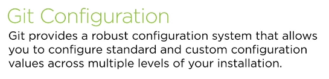
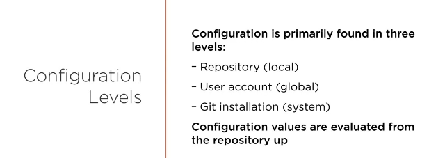
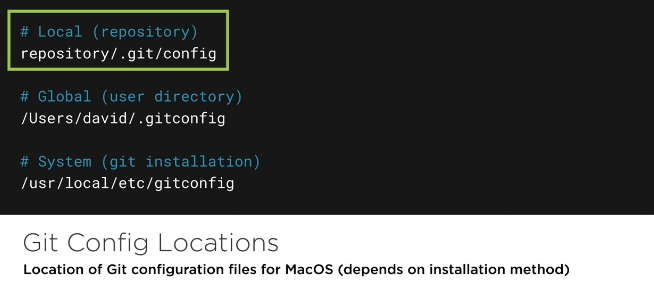
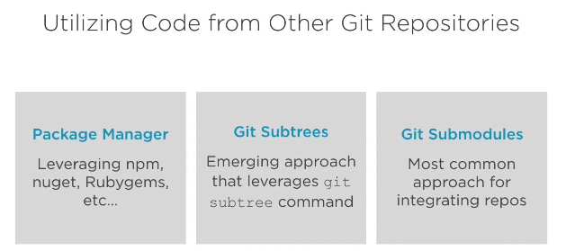
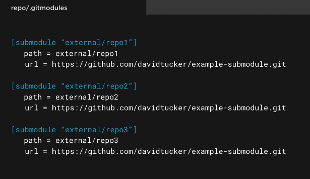
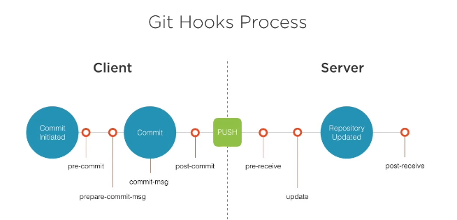
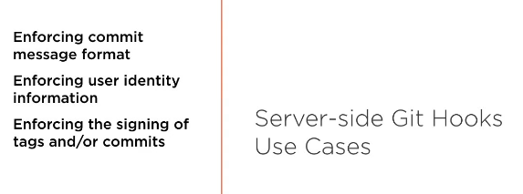
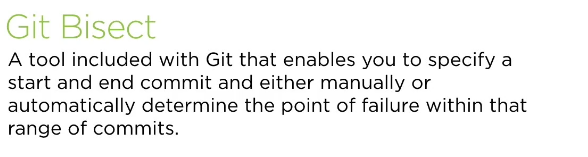
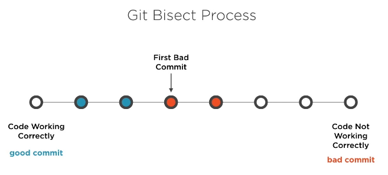
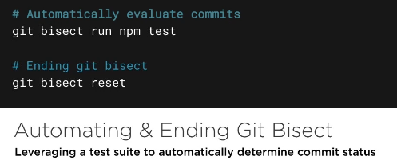

# Advanced Git Techniques
## Configuraion Git






##### Commands
```bash
# Show all config values and the file where they are defined
git config --list --show-origin

# Show the current user.name config value
git config user.name

# Remove a specific setting for a specific level of config
git config --global --unset user.name

# Edit a specific level of config directly
git config --global --edit

# Remove a section of config for a specific level
git config --global --remove-section user
```

### Configuration a git installation
```bash
git config --global user.name "momaadawi"
git config --global user.name.emial "mail@gmail.com"

# After inti repo you can check all configations system level, global level and local level key
git config --list --show-origin

# Update emial address only for repository
git config --local user.email "mail@domain.com"

# Edit editor for global
git config --global core.editor "code --new-window --wait"

# Edit config file
git config --global -e

# Open diffrence 
git difftool
```

###### Edit global to use vs code as defualt merge and diff tool
```bash
# edit global config
git config --global -e

# add or edit the following confi
[diff]
	tool = vscode-diff
[difftool]
	prompt = false
[difftool "vscode-diff"]
	cmd = code --new-window --wait --diff $LOCAL $REMOTE
[merge]
	tool = vscode-merge
[mergetool]
	prompt = false
[mergetool "vscode-merge"]
	cmd = code --new-window --wait --merge $LOCAL $REMOTE

# use the following commands to check diff or merge
git difftool
git mergetool
```

### Git Attributes
* 1 - Add .gitattributes file for new repository
* 2 - implement exif tool(tool to manipulate images audio and videos..) diffs for image files
* 3 - execluding files form realease packages on github
* 4 - adding a clean and smudge filter to hide secret values in repository

```bash
# 2
    # Download exif tool 
    https://exiftool.org/install.html#Windows

    git config --global diff.exif.textconv exiftool
    # whenever change happens to image use
    git diff

# 3

    # Open .gitattribute file
    # Git Attributes
    *.jpg diff=exif
    .*      export-ignore
    tests   export-ignore

# 4
git config --local filter.updateAPIKey.smudge 'sed "s/{SECURE_API_KEY}/a123/"'
git config --local filter.updateAPIKey.clean 'sed "s/a123/{SECURE_API_KEY}/"'

# Edit .gitattribute
# .js filter=updateAPIKEY
```

## Utilizing git submodules





#### Adding submodule to a project(not important)
```bash
git config --global status.submoduleSummary true
git config --global diff.submodule log

git clone <submodule url> external/module1

# to clone summodules of repo within
git clone --recusive <url> repo

# check for submodules
cat .gitmodules

#
git submoule foreach 'cat .gitmodules'

```

## Implementing a Git Workflow



>
post usually used for notification
>

#### Client-side git Hooks


##### Use cases


#### Server-side git hooks


##### Use cases


#### Implementing CLient-side Hooks
to view .git directory in vs code
- setting >> exclude >> unselect **.git

Edit hooks

#### Implementing Server-Side hooks
to simulate remote server use
git clone --bare <repo-url> <output folder>  

## Finding Bugs with git






