# Git Administration
## Serving Git Overview
### Git Hosting Options
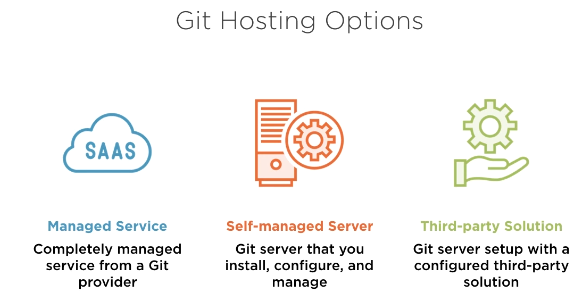
#### Git managed service providers
* Github
* Gitlab (Saas)
* BitBucket
* Microsoft Azure DevOps Repos

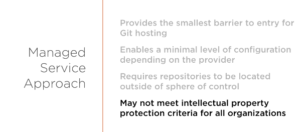

#### Third-party Git Solutions
* GitLab(self-managed)
* GitBUcket
* Gogs
* Gitea


#### Self-managed server approch
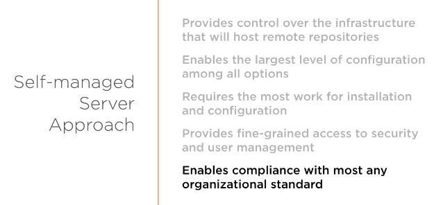

### Git Protocols
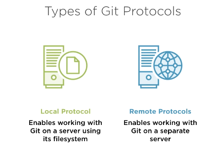

### Local Git Protocol
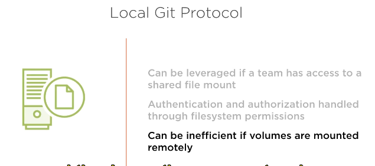

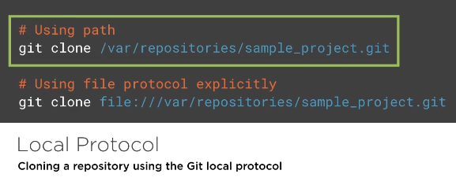

### Remote Git Protocols
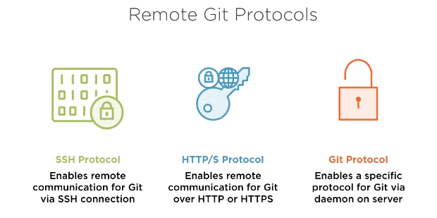

#### SSH Protocol
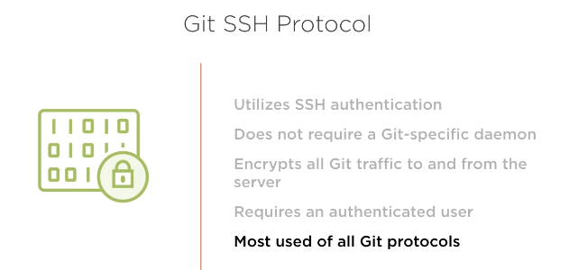

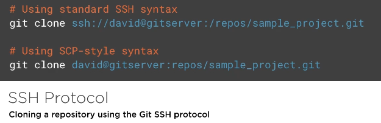

#### HTTP/S Protocol
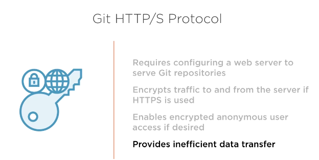

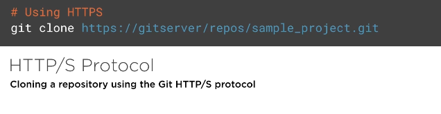

#### GIT Protocol specific
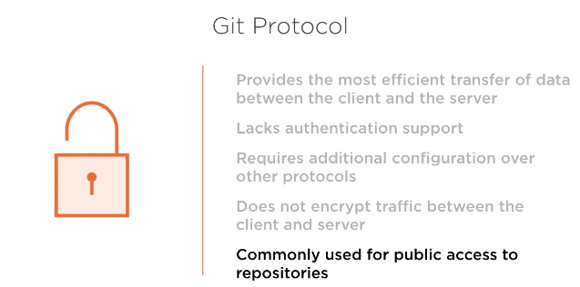

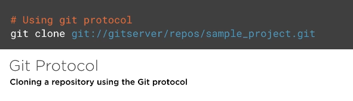

### Configuring base VM
* create vm instance on cloud provider(aws, azure)
* connect to server instance(ubuntu as an exmaple)
    ``` bash
    ssh -i <...key.pem> username@<DNS-name>
    ```
    - mkdir -p server/repo.git
    - git --bare init
    - cd #back
    - git clone 
* connect to client instance(ubuntu as an exmaple)
    ``` bash
    ssh -i <...key.pem> ubuntu@<DNS-name>
    ```
## Configuring Git for SSH Access
### SSH overview
SSh Approches
* single user 
* multi-user
## Configuring Git for HTTP Access


### HTTP protocol configuration 
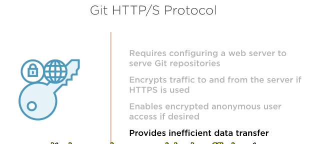

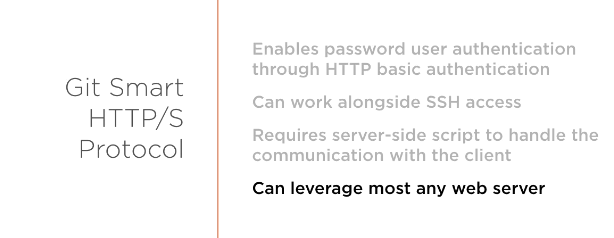
